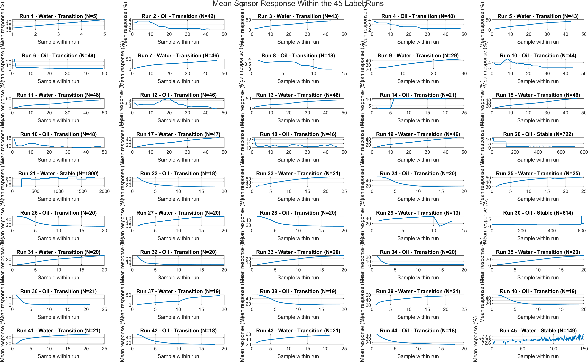

# Sensor Memory Analysis

This repository contains derived datasets and analysis code for studying sensor memory and early-state classification using a publicly available capacitive sensing dataset.

## Original dataset

The experimental measurements used in this work were previously published and released through IEEE DataPort:

Mahdi Saleh, Imad H. Elhajj, and Daniel Asmar,  
"Dataset for binary classification of digital sensor signals,"  
IEEE DataPort, 2020.  
DOI: 10.21227/6a44-0880

The original dataset contains 4,475 one-second samples. Each sample consists of 10 consecutive intensity measurements and a physical-state label:

- `+1`: Water
- `-1`: Oil

The original dataset is not reproduced in this repository. It can be obtained directly from IEEE DataPort.

## Dataset reconstruction

The sequential structure of the published dataset was reconstructed from the original physical-state labels.

Consecutive samples with the same label were grouped into 45 label runs. Based on the experimental acquisition structure, these were categorised as:

- **Transition recordings:** alternating Oil/Water recordings used to study sensor response following state changes.
- **Stable recordings:** prolonged recordings in a single physical state, used to characterise stable-state response.

Four prolonged stable-state runs were identified: Runs 20, 21, 30, and 45.

## Derived data

The repository contains derived annotations and analysis outputs generated from the public dataset, including:

- reconstructed label-run information;
- recorded state-change information;
- stable-state reference data;
- sensor-memory analysis outputs;
- classification analysis outputs.

## Analysis

The scripts reproduce the analysis used to investigate:

- sensor-memory persistence following recorded state changes;
- differences between Oil-to-Water and Water-to-Oil response behaviour;
- between-transition variability;
- early-state classification.

The analysis scripts are numbered in the order in which they should be run.

## Scripts

The analysis scripts are numbered in the order in which they should be run.

### S01 — Label-run reconstruction

Reconstructs consecutive physical-state label runs from the original dataset.

The script:

- groups consecutive samples with the same Oil/Water label;
- identifies 45 label runs;
- distinguishes transition recordings from prolonged stable-state recordings;
- generates the label-run annotation table and reconstruction figure.

### S02 — State-change reconstruction

Identifies the recorded physical-state changes between consecutive label runs.

The script:

- identifies 44 recorded state-change boundaries;
- assigns the source and destination runs to each transition;
- identifies the transition direction (Oil → Water or Water → Oil);
- retains the recording type of the source and destination runs.

The reconstructed dataset contains 22 Oil → Water and 22 Water → Oil recorded state changes.

## Citation

Citation details for the associated manuscript will be added following publication.